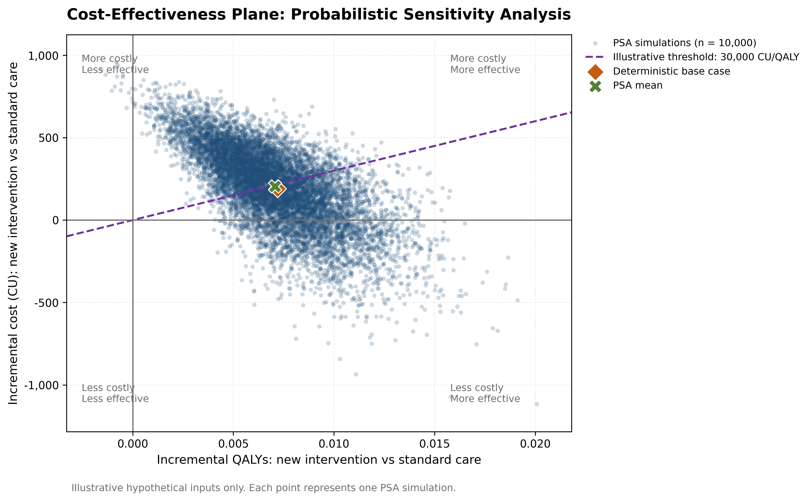
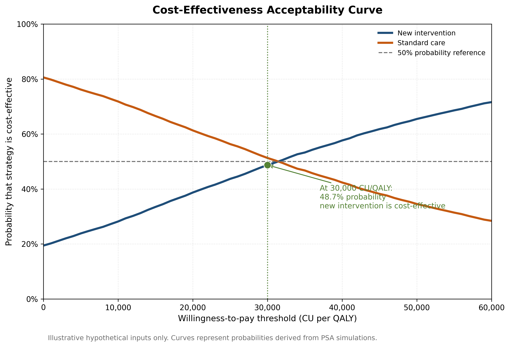
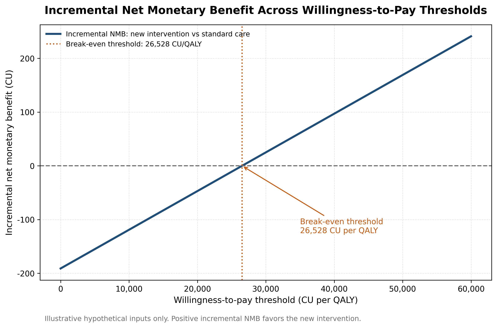
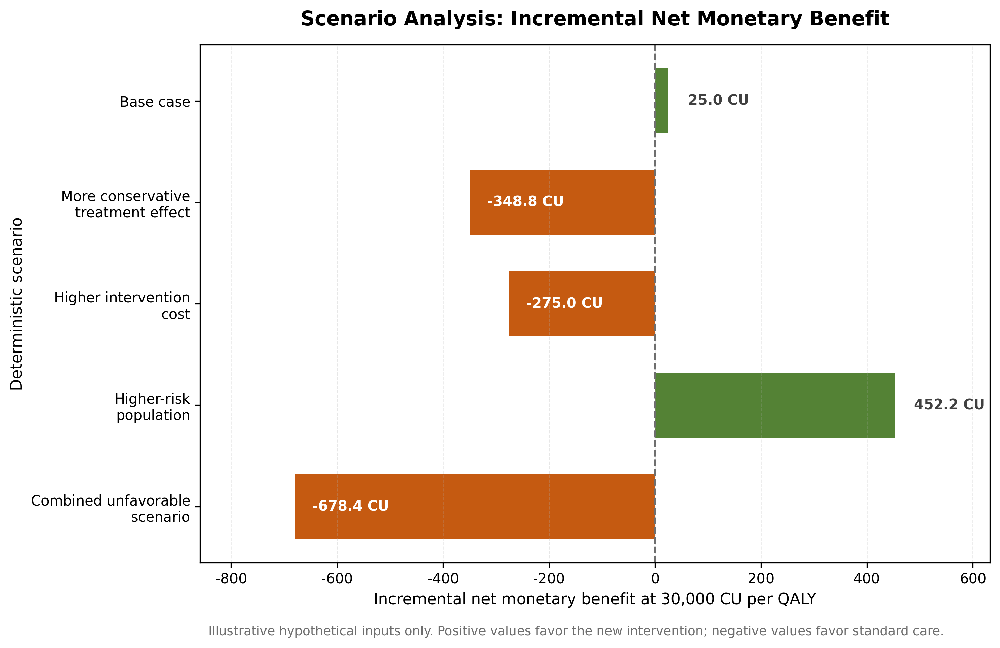

# Probabilistic Cost-Effectiveness Analysis for Health Technology Assessment Using Python

## Illustrative Decision Modeling and Uncertainty Propagation

This repository presents a transparent and reproducible **health-technology-assessment-style cost-effectiveness analysis** using Python.

## View the Complete Notebook

The complete notebook, including tables, figures, and interpretation, can be opened directly in Google Colab:

[Open the notebook in Google Colab](https://colab.research.google.com/github/drimransarmad/hta-probabilistic-cost-effectiveness-python/blob/main/HTA_Probabilistic_Cost_Effectiveness_Project.ipynb)

An alternative static preview is also available through NBViewer when its service is accessible:

[View the rendered notebook in NBViewer](https://nbviewer.org/github/drimransarmad/hta-probabilistic-cost-effectiveness-python/blob/main/HTA_Probabilistic_Cost_Effectiveness_Project.ipynb)


The project compares:

1. **Standard care**
2. **A hypothetical new health intervention**

The model demonstrates how statistical computing can support:

- Transparent decision modeling
- Deterministic base-case analysis
- Incremental cost-effectiveness analysis
- Net monetary benefit calculations
- Monte Carlo probabilistic sensitivity analysis
- Cost-effectiveness-plane interpretation
- Cost-effectiveness acceptability curves
- Scenario analysis
- Structured CSV and JSON exports
- Careful interpretation of decision uncertainty

---

## Professional Context

This project was developed as a research-oriented statistical-computing portfolio demonstration.

Python is used here as a **supporting capability** for reproducible decision modeling and uncertainty propagation within a broader quantitative-consulting approach focused on:

- Clinical and health research
- Real-world evidence
- Health economics and HTA-style interpretation
- Causal inference
- Advanced quantitative modeling
- Defensible statistical interpretation under uncertainty

The project does **not** reposition the work as generic data analytics or software development.

---

## Model Scope

The analysis uses a simplified **one-year cohort decision-tree model**.

Each patient receives either standard care or the hypothetical new intervention. During the one-year horizon, the patient may:

- Avoid the main adverse clinical event
- Experience the main adverse clinical event
- Experience a mild intervention-related adverse effect if receiving the new intervention

The intervention introduces an additional cost but may reduce the probability of the main adverse clinical event.

All inputs are clearly labeled as **illustrative assumptions**.

---

## Analytical Components

The notebook includes:

1. A structured model-input table
2. A transparent two-strategy decision matrix
3. Deterministic base-case analysis
4. Expected costs and expected QALYs for both strategies
5. Incremental cost and incremental QALYs
6. Incremental cost-effectiveness ratio (ICER)
7. Net monetary benefit across willingness-to-pay thresholds
8. Monte Carlo probabilistic sensitivity analysis with 10,000 simulations
9. Cost-effectiveness plane
10. Cost-effectiveness acceptability curve
11. Deterministic scenario analysis
12. Interpretation boundaries and methodological limitations
13. CSV summary exports
14. Structured JSON export

---

## Illustrative Base-Case Results

Under the hypothetical base-case assumptions:

| Metric | Result |
|---|---:|
| Standard-care expected cost | 2,850.00 CU |
| New-intervention expected cost | 3,041.00 CU |
| Incremental cost | 191.00 CU |
| Standard-care expected QALYs | 0.8360 |
| New-intervention expected QALYs | 0.8432 |
| Incremental QALYs | 0.0072 |
| ICER | 26,527.78 CU per additional QALY |

At an illustrative willingness-to-pay threshold of **30,000 CU per QALY**, the deterministic incremental net monetary benefit is:

| Metric | Result |
|---|---:|
| Incremental NMB | 25.00 CU |
| Favored strategy | New intervention |

The positive incremental NMB is small, indicating that the conclusion is sensitive to uncertainty.

---

## Probabilistic Sensitivity Analysis

The model propagates uncertainty across **10,000 Monte Carlo simulations**.

Appropriate illustrative distributions are used for different parameter types:

| Parameter type | Distribution |
|---|---:|
| Costs | Gamma |
| Probabilities | Beta |
| Relative risk | Lognormal |
| Bounded QALY losses | Scaled beta |

### Cost-Effectiveness-Plane Summary

| Outcome | Proportion of simulations |
|---|---:|
| More costly and more effective | 80.44% |
| Less costly and more effective: dominant | 19.41% |
| More costly and less effective: dominated | 0.15% |

At **30,000 CU per QALY**, the probability that the hypothetical new intervention is cost-effective is approximately:

| Metric | Result |
|---|---:|
| Probability new intervention is cost-effective | 48.72% |

This illustrates an important methodological point:

> A favorable deterministic ICER does not automatically imply a high degree of decision certainty.

---

## Scenario Analysis

The deterministic scenario analysis demonstrates that conclusions may change under alternative assumptions.

| Scenario | Incremental NMB at 30,000 CU per QALY | Favored strategy |
|---|---:|---|
| Base case | 25.00 CU | New intervention |
| More conservative treatment effect | −348.80 CU | Standard care |
| Higher intervention cost | −275.00 CU | Standard care |
| Higher-risk population | 452.20 CU | New intervention |
| Combined unfavorable scenario | −678.40 CU | Standard care |

The higher-risk scenario makes the new intervention **dominant**: less costly and more effective.

---

## Publication-Style Figures

### Cost-Effectiveness Plane



### Cost-Effectiveness Acceptability Curve



### Incremental Net Monetary Benefit Across Thresholds



### Scenario-Analysis Summary



---

## Repository Structure

```text
hta-probabilistic-cost-effectiveness-python/
├── README.md
├── HTA_Probabilistic_Cost_Effectiveness_Project.ipynb
├── outputs/
│   ├── cost_effectiveness_plane.png
│   ├── cost_effectiveness_acceptability_curve.png
│   ├── net_monetary_benefit_by_threshold.png
│   ├── scenario_analysis_summary.png
│   ├── hta_base_case_results.csv
│   ├── hta_psa_summary.csv
│   ├── hta_scenario_results.csv
│   └── hta_model_export.json
````

---

## Output Files

### Figures

* `cost_effectiveness_plane.png`
* `cost_effectiveness_acceptability_curve.png`
* `net_monetary_benefit_by_threshold.png`
* `scenario_analysis_summary.png`

### CSV Summary Tables

* `hta_base_case_results.csv`
* `hta_psa_summary.csv`
* `hta_scenario_results.csv`

### Structured JSON Dataset

* `hta_model_export.json`

The JSON export contains:

* Project metadata
* Base-case inputs
* PSA distribution specifications
* Deterministic results
* Net monetary benefit results
* PSA uncertainty summaries
* Cost-effectiveness-plane quadrant results
* CEAC probabilities
* Scenario-analysis results

---

## Methodological Limitations

This project deliberately prioritizes transparency and reproducibility over clinical complexity.

Important limitations include:

1. All model inputs and uncertainty assumptions are hypothetical.
2. The model uses a simplified one-year decision-tree structure.
3. The analysis does not model repeated events, mortality, competing risks, or long-term state transitions.
4. The project does not include evidence synthesis, survival extrapolation, calibration, or validation against real-world data.
5. The higher-risk scenario is illustrative and does not represent a validated subgroup analysis.
6. Monetary values are expressed in jurisdiction-neutral currency units.
7. Willingness-to-pay thresholds are illustrative.
8. The project is not a budget-impact analysis.

---

## Interpretation Boundary

> **This project is an illustrative statistical-computing demonstration using hypothetical inputs. It is not a clinical recommendation, reimbursement submission, validated decision tool, or substitute for a full health technology assessment informed by clinical evidence, resource-use data, jurisdiction-specific costs, utility studies, stakeholder input, and expert review.**

---

## Reproducibility

The notebook uses:

* A fixed random seed: `2026`
* A transparent input-parameter table
* Clearly specified uncertainty distributions
* Reproducible Monte Carlo simulations
* Clean CSV summary exports
* A structured JSON dataset

The project can be reproduced by running the notebook cells sequentially in Google Colab.

---

## Author

**Dr. Imran Sarmad**
**PhD Statistical Consultant | Advanced Quantitative Modeling (R, Mplus)**

Supporting capabilities demonstrated in this repository: Python statistical computing, decision modeling, uncertainty propagation, and reproducible quantitative interpretation.

Professional website: https://drimransarmad.com
